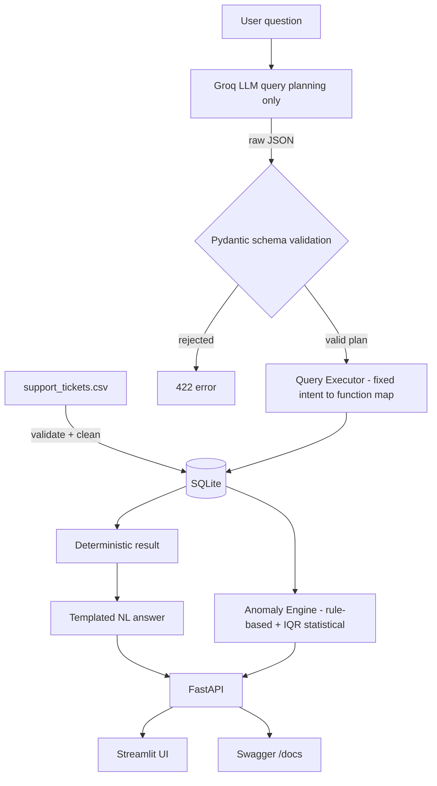

# 🎫 Support Ticket AI

**AI-powered customer-support ticket intelligence system** — ask questions about your ticket data in plain English and get proactive alerts on tickets that need attention.

Built for the DOTMappers AI Engineer Assessment. Ingests a 500-row support-ticket CSV into SQLite, uses an LLM (**Groq**, free tier) purely to understand natural-language questions, executes every query through a safe, deterministic engine (never raw LLM-generated SQL), and detects anomalies with both rule-based and statistical methods. Exposed through a **REST API (FastAPI)** and a **web UI (Streamlit)**.

---

## Table of Contents

- [Features](#features)
- [Demo](#demo)
- [Architecture](#architecture)
- [Tech Stack](#tech-stack)
- [Project Structure](#project-structure)
- [Getting Started](#getting-started)
  - [Prerequisites](#prerequisites)
  - [Installation](#installation)
  - [Configuration](#configuration)
  - [Running the App](#running-the-app)
  - [Running Tests](#running-tests)
- [Dataset](#dataset)
- [API Reference](#api-reference)
- [How the LLM Is Kept Safe](#how-the-llm-is-kept-safe)
- [Anomaly Detection](#anomaly-detection)
- [Design Decisions](#design-decisions)
- [Limitations & Future Work](#limitations--future-work)
- [License](#license)

---

## Features

- 💬 **Natural-language querying** — ask things like *"Which agent resolved the most tickets?"* and get a real, database-backed answer
- 🚨 **Anomaly detection** — flags tickets with abnormally long resolution times (statistical) and aging unresolved high-priority tickets (rule-based)
- 🔒 **Safe-by-design LLM integration** — the LLM only produces a structured query *plan*; it never writes or executes SQL, and every plan is schema-validated before touching the database
- 🌐 **REST API** — `/health`, `/query`, `/anomalies`, documented with interactive Swagger UI
- 🖥️ **Minimal web UI** — Streamlit app with a query console, anomaly dashboard, and system status panel
- 🆓 **Zero-cost to run** — local SQLite (no server) + Groq's free-tier LLM
- ⚡ **Single-command startup** — `python run.py` launches everything
- ✅ **Tested** — 14 automated tests covering ingestion, anomaly rules, the query executor, and the API, none of which require a live LLM key to run

---

## Demo

**Example query, run against the real dataset:**

```
Q: Which agent resolved the most tickets?
A: Top agent by resolved ticket count is AGT-12 (37).
```

**Example anomaly output:**

```json
{
  "ticket_id": "TKT-045",
  "type": "long_resolution_time",
  "reason": "Resolution time of 119.7 hrs exceeds the statistical upper bound of 41.2 hrs (Q3 + 1.5x IQR across 327 resolved tickets).",
  "resolution_time_hrs": 119.7,
  "priority": "Critical",
  "category": "Technical",
  "agent_id": "AGT-02"
}
```

More examples in [API Reference](#api-reference).

---

## Architecture



**Why the LLM never touches the database directly:** the LLM's only responsibility is natural-language understanding — turning a question into a structured plan (`intent` + `filters`). That raw JSON is validated against a strict Pydantic schema (`app/llm/schemas.py`) with a fixed set of allowed intents and filter fields. The validated plan is then mapped to one of a handful of predefined, parameterized repository functions (`app/database/repository.py`). There is no code path where LLM output becomes SQL.

**Why the final answer is template-based, not a second LLM call:** this guarantees the number stated in the answer always exactly matches what the database returned — the LLM cannot round, embellish, or hallucinate a figure. See [Design Decisions](#design-decisions) for the full reasoning.

---

## Tech Stack

| Layer | Technology |
|---|---|
| API | FastAPI + Uvicorn |
| UI | Streamlit |
| Database | SQLite + SQLAlchemy ORM |
| Data processing | pandas |
| LLM (query planning) | Groq (free tier), OpenAI-compatible chat completions |
| Validation | Pydantic v2 |
| Testing | pytest |

---

## Project Structure

```
support-ticket-ai/
├── app/
│   ├── main.py                    # FastAPI app + startup ingestion
│   ├── api/
│   │   ├── routes_query.py        # POST /query
│   │   ├── routes_anomalies.py    # GET /anomalies
│   │   └── routes_health.py       # GET /health
│   ├── core/
│   │   ├── config.py              # env-driven configuration
│   │   └── logging_config.py
│   ├── ingestion/
│   │   ├── csv_loader.py          # read CSV
│   │   ├── validator.py           # schema + value validation
│   │   └── database_loader.py     # clean + load into SQLite
│   ├── database/
│   │   ├── models.py              # SQLAlchemy Ticket model
│   │   ├── connection.py          # engine/session management
│   │   └── repository.py          # safe, parameterized query functions
│   ├── llm/
│   │   ├── client.py              # Groq client (planning only)
│   │   ├── prompts.py             # system prompt for the query planner
│   │   └── schemas.py             # Pydantic QueryPlan validation
│   ├── services/
│   │   ├── query_service.py       # orchestrates LLM → validate → execute
│   │   ├── query_executor.py      # validated plan → repository function
│   │   ├── answer_formatter.py    # templated NL answers
│   │   └── anomaly_service.py     # rule-based + IQR anomaly detection
│   └── schemas/                   # API request/response models
├── ui/
│   └── streamlit_app.py           # query console, anomaly dashboard, status
├── data/
│   └── support_tickets.csv        # provided dataset (500 rows)
├── tests/                         # 14 pytest tests
├── requirements.txt
├── .env.example
├── run.py                         # single-command startup (API + UI)
└── README.md
```

---

## Getting Started

### Prerequisites

- Python 3.10+
- A free [Groq API key](https://console.groq.com/keys) (no credit card required)

### Installation

```bash
git clone https://github.com/<your-username>/support-ticket-ai.git
cd support-ticket-ai

python -m venv .venv
source .venv/bin/activate          # Windows: .venv\Scripts\activate

pip install -r requirements.txt
```

### Configuration

```bash
cp .env.example .env               # Windows: copy .env.example .env
```

Open `.env` and set your Groq key:

```dotenv
GROQ_API_KEY=your_actual_key_here
GROQ_MODEL=openai/gpt-oss-120b
```

<details>
<summary>All configuration options</summary>

| Variable | Default | Description |
|---|---|---|
| `GROQ_API_KEY` | *(required)* | Your Groq API key |
| `GROQ_MODEL` | `openai/gpt-oss-120b` | Groq model used for query planning |
| `CSV_PATH` | `data/support_tickets.csv` | Path to the source CSV |
| `DATABASE_URL` | `sqlite:///data/tickets.db` | SQLAlchemy connection string |
| `HIGH_PRIORITY_AGE_HOURS` | `24` | Rule-based anomaly threshold (hours) |
| `IQR_MULTIPLIER` | `1.5` | Statistical outlier sensitivity |
| `UNRESOLVED_DEFINITION` | `not_resolved` | `not_resolved` (Open+Escalated) or `open_only` |
| `API_PORT` | `8000` | FastAPI port |
| `STREAMLIT_PORT` | `8501` | Streamlit port |

</details>

### Running the App

```bash
python run.py
```

This single command starts both servers and ingests the CSV automatically on first run:

- 📘 API docs: **http://127.0.0.1:8000/docs**
- 🖥️ Web UI: **http://127.0.0.1:8501**

Press `Ctrl+C` to stop both cleanly.

<details>
<summary>Run components separately (optional)</summary>

```bash
uvicorn app.main:app --reload --port 8000     # API only
streamlit run ui/streamlit_app.py             # UI only (needs API running)
```
</details>

### Running Tests

```bash
pytest -q
```

All 14 tests pass without a Groq key — they test ingestion, the anomaly engine, and the query executor directly against a real (in-memory) database, independent of the LLM.

---

## Dataset

`data/support_tickets.csv` — 500 rows, 10 columns.

| Column | Type | Notes |
|---|---|---|
| `ticket_id` | string | unique identifier |
| `created_at` | datetime | parsed for age/date filtering |
| `category` | string | Billing / Technical / General |
| `priority` | string | Low / Medium / High / Critical |
| `status` | string | Open / Resolved / Escalated |
| `response_time_hrs` | float | hours to first response |
| `resolution_time_hrs` | float, nullable | **null = unresolved**, never 0 |
| `agent_id` | string | assigned agent |
| `customer_rating` | float 1–5, nullable | **null = not rated**, never 0 |
| `issue_summary` | string | free text |

**173 rows have null `resolution_time_hrs` and null `customer_rating`.** These are preserved as SQL `NULL` throughout the pipeline:

- `resolution_time_hrs IS NULL` → ticket is unresolved → excluded from resolution-time statistics (never treated as 0)
- `customer_rating IS NULL` → no rating given → excluded from `average_rating` via an explicit `IS NOT NULL` filter

> **What "unresolved" means:** defined as `status != 'Resolved'` (i.e. `Open` **or** `Escalated`) by default — configurable via `UNRESOLVED_DEFINITION` in `.env`.

---

## API Reference

### `GET /health`
Returns service status, DB connectivity, ticket count, and whether the LLM key is configured.

```json
{
  "status": "ok",
  "database": "connected",
  "ticket_count": 500,
  "model": "available"
}
```

### `POST /query`
Ask a natural-language question.

**Request**
```json
{ "question": "How many critical tickets are unresolved?" }
```

**Response**
```json
{
  "question": "How many critical tickets are unresolved?",
  "answer": "There are 31 ticket(s) (Critical priority, unresolved).",
  "intent": "count_tickets",
  "plan": { "intent": "count_tickets", "filters": { "priority": "Critical", "unresolved": true } },
  "data": { "count": 31 }
}
```

Supported question types:

| Type | Example |
|---|---|
| Count | "How many tickets are currently open?" |
| Filter / list | "Show me all Critical tickets not resolved within 12 hours" |
| Average rating | "What is the average customer rating for Technical tickets?" |
| Agent ranking | "Which agent resolved the most tickets this month?" |
| Resolution analysis | "What is the average resolution time for Critical tickets?" |
| Anomaly summary | "Are there any anomalies in resolution times this week?" |

Relative-date phrases ("this month", "this week", "today", "last 7/30 days") are
resolved to real date ranges by the application (`app/utils/datetime_utils.py`),
not guessed by the LLM. Since this dataset is a static snapshot (Jan–Mar 2024),
set `AS_OF_DATE` in `.env` (e.g. `AS_OF_DATE=2024-03-15`) to demo these against
data that actually falls in range — otherwise they correctly return "0 results"
relative to today's real date, which is expected behavior for a live system.

### `GET /anomalies`
Returns all currently flagged tickets.

```json
{
  "total_anomalies": 101,
  "anomalies": [
    {
      "ticket_id": "TKT-233",
      "type": "unresolved_high_priority",
      "reason": "High priority ticket has been open for 23719.6 hrs, exceeding the 24-hour threshold.",
      "priority": "High", "status": "Open", "age_hrs": 23719.6, "agent_id": "AGT-06"
    }
  ]
}
```

---

## How the LLM Is Kept Safe

```
Question → Groq LLM → raw JSON → Pydantic validation → Query Executor → SQLite
                          ↑                  ↑                 ↑
                    NL understanding   allowed intents /   fixed intent →
                    only, no DB        filters only        function map only
                    access                                 (never raw SQL)
```

- The LLM's system prompt (`app/llm/prompts.py`) restricts it to **6 allowed intents** and a fixed set of filter fields — it is explicitly told never to produce SQL or invent numbers.
- Every response is parsed and validated against a strict Pydantic schema (`app/llm/schemas.py`); anything outside the allowed shape is rejected before it can reach the database.
- The query executor (`app/services/query_executor.py`) is a closed `if/elif` dispatcher — the LLM selects *which* predefined function to call and *what values* to filter by, never *what code* to run.
- The final answer sentence is generated by Python string templates (`app/services/answer_formatter.py`), not by the LLM — so the number shown to the user is always exactly what the database returned.

---

## Anomaly Detection

Two independent, complementary methods:

**1. Rule-based** — catches known business-risk conditions:
```
IF priority IN (High, Critical)
AND status != Resolved
AND age_hours > HIGH_PRIORITY_AGE_HOURS (default 24)
THEN flag as "unresolved_high_priority"
```

**2. Statistical (IQR)** — catches unusual resolution times without a manually fixed threshold:
```
Q1, Q3 = 25th / 75th percentile of resolution_time_hrs
IQR = Q3 - Q1
upper_bound = Q3 + 1.5 × IQR
Any resolved ticket above upper_bound → flag as "long_resolution_time"
```

Both return the ticket ID, a human-readable reason, and the supporting values — no black-box scoring.

---

## Design Decisions

| Decision | Reasoning |
|---|---|
| SQLite over Postgres | 500 rows, zero-cost local evaluation; swappable via `DATABASE_URL` if it needed to scale |
| Groq over local Ollama | Faster to demo, no local model download required; both are equally valid per the brief's "zero-cost" requirement |
| LLM plans queries, never writes SQL | Prevents prompt-injection or hallucination from ever reaching the database |
| Answer sentences are templated, not LLM-generated | Guarantees stated numbers are never hallucinated |
| Rule-based *and* statistical anomaly detection | Rules catch known business risks explicitly; IQR catches unknown patterns without a hardcoded threshold |

---

## Limitations & Future Work

- **Relative dates now resolve to real date ranges.** "This month", "this week", "today", "last 7/30 days" are resolved by the application (`app/utils/datetime_utils.py`), not guessed by the LLM. Since this dataset is static (Jan–Mar 2024), set `AS_OF_DATE` in `.env` to demo these meaningfully against the sample data — without it, they correctly report 0 results relative to today's real date.
- **Anomaly ages are wall-clock by default**, so replaying this exact static CSV against the real current date will flag most open tickets as very old. Setting `AS_OF_DATE` (same variable as above) also fixes this for demos, since both features share the same time-reference helper.
- **No second LLM pass for phrasing** — answers are templated for reliability; a richer version could add a constrained LLM pass purely for tone while still injecting verified numbers.
- **No auth / rate limiting** on the API — fine for local evaluation, not production-ready as-is.
- **Single-table schema** — agent metadata beyond `agent_id` isn't modeled; a production version would likely join against an agents table.

---

## License

Built as an assessment submission. Use freely for evaluation purposes.
